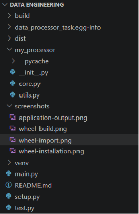
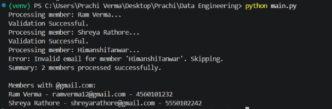
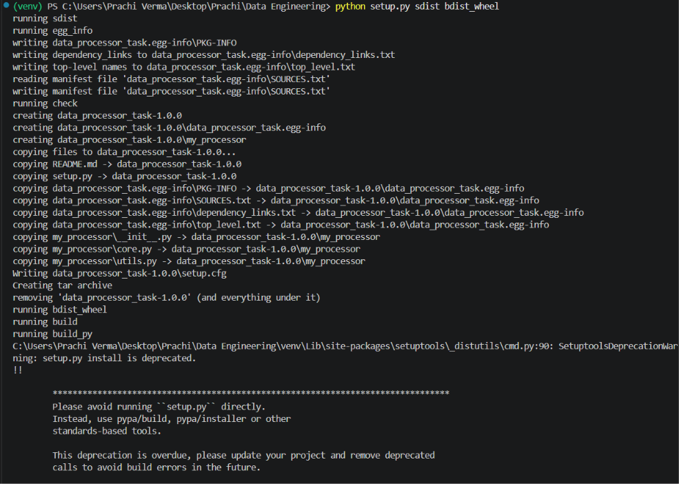
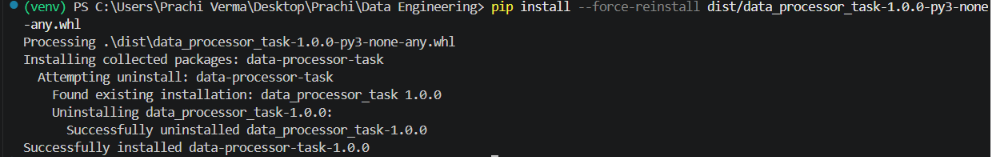
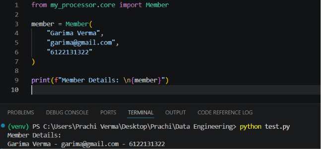

# Python Core Integrated Assignment

## Overview

Data Processor is a Python Core Concepts training assignment that implements a small Member Data Management System. It processes a hardcoded list of raw member dictionaries, cleans and validates each member's data, creates `Member` objects for valid entries, raises custom exceptions for invalid ones, and filters the resulting members by email domain.

---

## Project Structure

```
data-engineering-1/
│
├── my_processor/
│   ├── __init__.py       
│   ├── core.py          
│   └── utils.py         
│
├── screenshots/
│   ├── project-structure.png
│   ├── application-output.png
│   ├── wheel-build.png
│   ├── wheel-installation.png
│   └── wheel-import.png
│
├── main.py             
├── setup.py             
├── README.md
```

---

---

## Setup

**1. Create a virtual environment:**
```bash
python -m venv venv
```

**2. Activate it (Windows PowerShell):**
```bash
venv\Scripts\activate
```

**3. Install required packaging tools:**
```bash
python -m pip install --upgrade pip setuptools wheel
```

---

## Running the Application

```bash
python main.py
```

---

## Building the Wheel

This project uses the assignment's `setup.py`-based packaging approach.

```bash
python setup.py sdist bdist_wheel
```

The generated `.whl` file will appear inside the `dist/` directory:

```
dist/
└── data_processor_task-1.0.0-py3-none-any.whl
```

---

## Installing the Wheel

```bash
pip install dist/data_processor_task-1.0.0-py3-none-any.whl
```

If the package is already installed, use `--force-reinstall`:

```bash
pip install --force-reinstall dist/data_processor_task-1.0.0-py3-none-any.whl
```

---

## Screenshots

### Project Structure


### Application Output 


### Wheel Build 


### Wheel Installation 


### Wheel Import


---

## Author
Prachi Verma